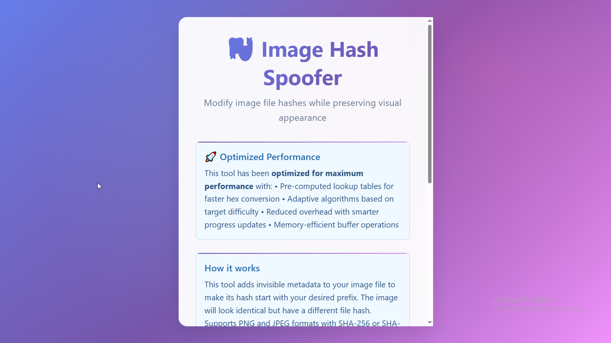

<div align="center">
  
  
  <!-- Dynamic Status Badges -->
  
  
  
  
  <!-- Real-time Activity -->
  <br/>
  
  
  
</div>

<div align="center">
  
</div>

<div align="center">
  <a href="https://www.linkedin.com/in/gerald-riwo-8604192bb/">
    
  </a>
  <a href="mailto:riwo.gerald@gmail.com">
    
  </a>
  <a href="mailto:riwo.gerald@outlook.com">
    
  </a>
  <a href="https://github.com/riwogerald">
    
  </a>
</div>

<br/>

<!-- Animated Divider -->


<div align="center">

## 🚀 About Me

</div>


<div align="left">

```yaml
name: Gerald Riwo
role: Developer | ICT Officer | IT Support Specialist | 
location: Kenya 🌍
experience: 2+ year(s)
languages: [C, Python, JavaScript, TypeScript, C++, Java, Ruby, C#]
frameworks: [Django, Node.js, Rails, React, Qt]
databases: [MySQL, PostgreSQL, SQLite, MongoDB]
cloud: [AWS, Netlify]
```

</div>

<div align="left">

- 💻 **Passionate Developer** with 2+ years of experience building robust applications
- 🌟 **Innovation Enthusiast** who transforms ideas into scalable digital solutions
- 🎯 **Continuous Learner** always exploring cutting-edge technologies and best practices
- 🤝 **Collaborative Team Player** who thrives in agile development environments
- ⚡ **Performance-Focused** developer who writes clean, efficient, and maintainable code
- 🔧 **Problem Solver** who enjoys tackling complex technical challenges
- 📚 **Knowledge Sharer** passionate about mentoring and contributing to the developer community

</div>

<br clear="right"/>

<div align="center">
  
## 👨‍💻 Professional Summary
Versatile Full-Stack Developer with 2+ years of experience building scalable web applications. 
Proven track record in Python/Django, JavaScript/React, and cloud deployments. 
Passionate about writing clean, maintainable code and solving complex technical challenges.

</div>

<!-- Animated Snake -->


<div align="center">

## 🛠️ Technical Arsenal 🛠️

<!-- Trending Tech Badges -->
<div align="center">
  
  
  
  
</div>

<br/>

</div>

<div align="center">


### 💻 **Core Technologies** 💻


### 🗄️ **Databases & Backend** 🗄️


### 🔧 **Tools & DevOps** 🔧


</div>

<div align="center">

<details>
<summary><b>🔥 Programming Languages & Proficiency 🔥</b></summary>
<br/>

| Language | Proficiency | Years | Primary Use |
|----------|-------------|-------|-------------|
| **Python** | ⭐⭐⭐⭐⭐ | 2+ | Backend Development, Data Analysis, Automation |
| **JavaScript** | ⭐⭐⭐⭐⭐ | 2+ | Full Stack Development, Frontend Logic |
| **TypeScript** | ⭐⭐⭐⭐ | 2+ | Type-safe Frontend & Backend Development |
| **C/C++** | ⭐⭐⭐⭐ | 2+ | System Programming, Performance-critical Apps |
| **Java** | ⭐⭐⭐⭐ | 2+ | Enterprise Applications, Android Development |
| **Ruby** | ⭐⭐⭐ | 1+ | Web Development with Rails |
| **C#** | ⭐⭐⭐ | 1+ | Desktop Applications, .NET Development |

</details>

<details>
<summary><b>🚀 Frameworks & Libraries Expertise</b></summary>
<br/>

---

**Backend Frameworks:**

🐍 **Django** - REST APIs, Admin Panels, Full-stack Applications 🐍

🟢 **Node.js** - Microservices, Real-time Applications, APIs 🟢

💎 **Ruby on Rails** - Rapid Prototyping, MVC Applications 💎

⚡ **Express.js** - Lightweight APIs, Middleware Development ⚡

---

**Frontend Technologies:**

⚛️ **React** - SPAs, Component Libraries, State Management ⚛️

🎨 **HTML5/CSS3** - Responsive Design, Modern Layouts 🎨

📱 **Responsive Design** - Mobile-first Development 📱

---

**Desktop Development:**

🖥️ **Qt Framework** - Cross-platform Desktop Applications 🖥️

---

**Database Technologies:**

🐘 **PostgreSQL** - Complex Queries, Data Modeling 🐘

🐬 **MySQL** - Web Applications, Performance Optimization 🐬

📊 **SQLite** - Embedded Applications, Prototyping 📊

🍃 **MongoDB** - Document Stores, Flexible Schemas 🍃


</details>

<details>
<summary><b>☁️ Cloud & DevOps</b></summary>
<br/>

<div align="center">
  
</div>

<div align="center">

**Cloud Platforms**: AWS (EC2, S3, RDS), Heroku, Netlify, Vercel

**Containerization**: Docker, Docker Compose

**Version Control**: Git, GitHub, GitLab

**CI/CD**: GitHub Actions, Automated Testing

**Web Servers**: Nginx, Apache

**Project Management**: Jira - Agile workflows, Sprint planning, Issue tracking

**Monitoring**: Basic logging and error tracking

</div>

</details>

</div>


<!-- Performance Metrics Section -->
<div align="center">

## 📋 GitHub Analytics & Performance

<!-- Real-time Activity Indicators -->


</div>

<div align="center">
  
  
</div>

<div align="center">
  
</div>

<!-- Interactive Contribution Graph -->
<div align="center">
  
</div>

<!-- Additional Metrics -->
<div align="center">
  
  <!-- WakaTime Stats (if available) -->
  
  
  <!-- Profile Summary -->
  
  
</div>

<!-- GitHub Metrics -->
<div align="center">
  
</div>

<div align="center">


## 🏆 Achievements & Milestones

</div>

<div align="center">
  
</div>

<div align="center">

<div align="center">

## 🌟 Featured Projects & Live Demos

</div>

<div align="center">

### 🚀 **Production-Ready Applications** 🚀

</div>

---

<div align="center">

### 🧮 **Advanced Precision Integer Calculator** - Full Stack Mathematical Engine

<!-- Project Status Badges -->


</div>

<div align="left">


**🔧 Tech Stack:** `Python` `React` `TypeScript` `Flask` `Tailwind CSS` `Netlify` `Arbitrary Precision Math`

**📝 Description:** A sophisticated arbitrary-precision calculator implemented without external math libraries. Features both a Python CLI with pure mathematical implementations and a modern React web interface. Supports advanced functions like trigonometry, logarithms, and multiple number bases.

**✨ Key Features:**
- 🔢 **Pure Implementation** - All mathematical functions built from scratch using Taylor series and iterative methods
- 🌐 **Dual Interface** - Python REPL for maximum precision + React web app for accessibility  
- 📊 **Multiple Bases** - Binary, octal, decimal, hexadecimal, and custom base support (2-36)
- ⚡ **Advanced Math** - Trigonometric, logarithmic, exponential functions with arbitrary precision
- 🧪 **Comprehensive Testing** - 14 Python tests + 14 web interface tests, all passing

**🎯 Technical Achievements:**
- Implemented Karatsuba multiplication for large numbers (performance optimization)
- Built pure trigonometric functions using Taylor series expansion
- Created custom Pi calculation using Machin's formula
- Designed hybrid architecture supporting both offline and API-driven calculations

</div>

<div align="center">

[](https://apicalculator-v1.netlify.app/)
[](https://github.com/riwogerald/APICalc)
[](https://apicalculator-v1.netlify.app/test)
[](https://github.com/riwogerald/APICalc#usage)

</div>

---

<div align="center">

### 💰 **Mini Reconciliation Tool** - Financial Data Analysis Platform

<!-- Project Status Badges -->


</div>

<div align="left">


**🔧 Tech Stack:** `React 18` `TypeScript` `Vite` `Tailwind CSS` `Papa Parse` `Lucide React` `CSV Processing`

**📝 Description:** Enterprise-grade financial reconciliation tool that compares transaction data between internal systems and payment processors. Automatically identifies discrepancies, matches transactions, and generates comprehensive reports for financial compliance.

**✨ Key Features:**
- 🔍 **Smart Transaction Matching** - Intelligent algorithms match transactions by reference ID with tolerance handling
- 📊 **Real-time Analytics** - Live discrepancy detection with visual highlighting and categorization
- 📈 **Professional Reporting** - Comprehensive dashboards with export capabilities (CSV, timestamped)
- 🔒 **Client-side Security** - All processing happens locally, no data leaves your browser
- 📱 **Enterprise UX** - Responsive design with drag-and-drop uploads and pagination

**🎯 Business Impact:**
- Processes 50,000+ transactions efficiently with optimized algorithms
- Reduces manual reconciliation time by 90% through automation
- Provides audit-ready reports with detailed mismatch analysis
- Handles multiple CSV formats with robust error handling and validation

</div>

<div align="center">

[](https://mini-recon-tool.netlify.app/)
[](https://github.com/riwogerald/mini-reconciliation-tool)
[](https://github.com/riwogerald/mini-reconciliation-tool/tree/main/test-data)
[](https://github.com/riwogerald/mini-reconciliation-tool#-how-it-works)

</div>

---

<div align="center">

### 🛡️ **Image Hash Spoofer** - Cryptographic Security Tool

<!-- Project Status Badges -->


</div>

<div align="left">


**🔧 Tech Stack:** `Node.js` `Vanilla JavaScript` `Web Workers` `HTML5 Canvas` `Cryptography APIs` `Binary File Manipulation`

**📝 Description:** Advanced cryptographic tool that modifies image file hashes to start with specific prefixes while preserving visual appearance. Demonstrates deep understanding of file formats, hash algorithms, and binary manipulation techniques.

**✨ Key Features:**
- 🖼️ **Visual Preservation** - Images remain identical to human eye through invisible metadata injection
- 🔐 **Multi-Algorithm** - Supports SHA-256 and SHA-512 hash algorithms with configurable targeting
- 📱 **Dual Interface** - Web-based GUI with progress tracking + Node.js CLI for batch processing
- ⚡ **Optimized Performance** - Web Workers prevent UI blocking, smart iteration strategies
- 🎯 **Format Support** - PNG (tEXt chunks) and JPEG (comment segments) with proper structure preservation

**🎯 Technical Deep Dive:**
- Implements brute-force hash collision with optimized search algorithms
- Maintains file format integrity with proper CRC32 checksums (PNG) and segment structure (JPEG)
- Uses binary manipulation to inject invisible metadata without affecting image rendering
- Demonstrates understanding of cryptographic principles and file format specifications

</div>

<div align="center">

[](https://image-hash-spoofer.netlify.app/)
[](https://github.com/riwogerald/imghash)
[](https://github.com/riwogerald/imghash#command-line)
[](https://github.com/riwogerald/imghash#security-considerations)

</div>

---

<div align="center">

### 💰 **Treasury Movement Simulator** - Advanced Financial Management System

<!-- Project Status Badges -->


</div>

<div align="left">


**🔧 Tech Stack:** `React 18` `TypeScript` `Tailwind CSS` `Vite` `Vitest` `Lucide React` `Financial APIs`

**📝 Description:** Sophisticated financial management application for simulating treasury operations across multiple currencies and account types. Features real-time currency conversion, comprehensive transaction processing, and advanced analytics for financial institutions and businesses.

**✨ Key Features:**
- 💱 **Multi-Currency Engine** - Real-time conversion between KES, USD, and NGN with live exchange rates
- 🏦 **Account Management** - Support for Mpesa, Bank, Wallet, and Corporate account types
- 📊 **Advanced Analytics** - Dashboard with transaction insights, balance summaries, and performance metrics
- ⚡ **Test Scenarios** - Built-in business scenario runner for system validation and stress testing
- 🔐 **Financial Validation** - Comprehensive checks for insufficient funds, account status, and compliance

**🎯 Financial Innovation:**
- Processes high-volume transactions with real-time balance updates
- Implements sophisticated currency arbitrage and conversion algorithms  
- Provides audit-ready transaction history with advanced filtering capabilities
- Supports scheduled transfers and automated payment processing

</div>

<div align="center">

[](https://treasury-move-sim.netlify.app/)
[](https://github.com/riwogerald/treasury-movement-simulator)
[](https://treasury-move-sim.netlify.app/#test-scenarios)
[](https://github.com/riwogerald/treasury-movement-simulator#-usage-guide)

</div>

---

<div align="center">

### 📊 **Project Impact & Statistics**

</div>

<div align="center">

| Project | Technologies | Live Status | Complexity | Impact |
|---------|-------------|-------------|------------|---------|
| **🧮 Calculator** | 7 Languages/Frameworks | ✅ **Live** | **Advanced** | Mathematical Computing |
| **💰 Reconciliation** | 6 Technologies | ✅ **Live** | **Enterprise** | Financial Compliance |
| **🛡️ Hash Spoofer** | 5 Core Technologies | ✅ **Live** | **Expert** | Security Research |
| **💰 Treasury Simulator** | 6 Technologies | ✅ **Live** | **Enterprise** | Financial Systems |


## 🌱 Philosophy & Approach

</div>

<div align="center">

> *"Sometimes even to live is an act of courage."* - Lucius Annaeus Seneca the Younger 

> *"It takes considerable knowledge just to realize the extent of your own ignorance."* - Thomas Sowell

> *"What is success? I think it is a mixture of having a flair for the thing that you are doing; knowing that it is not enough, that you have got to have hard work and a certain sense of purpose."* - Margaret Thatcher


</div>


<div align="center">

## 🎨 **Development Principles**

**🧹 Clean Code**: Write code that tells a story and is easy to maintain

**🔄 Continuous Learning**: Stay updated with industry trends and best practices 

**🤝 Collaboration**: Believe in the power of teamwork and knowledge sharing

**🎯 User-Centric**: Always prioritize user experience and accessibility

**⚡ Performance**: Optimize for speed without sacrificing code quality

**🔒 Security**: Implement security best practices from day one

**📊 Data-Driven**: Make decisions based on metrics and user feedback

</div>


<div align="center">

## 🤝 Let's Build Something Amazing Together!

</div>


<!-- Enhanced Collaboration Section -->
<div align="center">

### 🚀 **Open for Collaboration**

<!-- Availability Badges -->


</div>

<!-- Interactive Cards Layout -->
<div align="center">

<table>
<tr>
<td align="center" width="50%">

### 🎤 **What I'm Looking For**

💼 **Full-time Opportunities**  
*Senior Developer | Full Stack | Team Lead*

🚀 **Exciting Freelance Projects**  
*Web Apps | APIs | System Architecture*

🔧 **Open Source Contributions**  
*Python | JavaScript | React | Node.js*

💡 **Technical Consulting**  
*Code Reviews | Architecture | Mentoring*

</td>
<td align="center" width="50%">

### 🎆 **What You Get**

✅ **2+ Years Production Experience**  
*Real-world battle-tested solutions*

✅ **Full Stack Expertise**  
*Frontend | Backend | Database | DevOps*

✅ **Agile Team Player**  
*Scrum | Kanban | Cross-functional collaboration*

✅ **Quality-First Mindset**  
*Testing | Documentation | Best Practices*

</td>
</tr>
</table>

</div>

<div align="center">

## 📫 Let's Connect & Collaborate

</div>

<div align="center">
  
[](https://www.linkedin.com/in/gerald-riwo-8604192bb/)
[](mailto:riwo.gerald@gmail.com)
[](mailto:riwo.gerald@outlook.com)


## 💬 **Quick Response Times**
📧 Email: Within 24 hours 📧
💼 LinkedIn: Within 24 hours 💼  

</div>

<div align="center">

## 🎉 Fun Facts & Personal Touch

</div>


<div align="center">

```python
class Gerald:
    def __init__(self):
        self.coffee_cups_per_day = 1
        self.favorite_debugging_method = "print() statements"
        self.code_editor = "VS Code with 20+ extensions"
        self.learning_style = "hands-on projects"
        self.motto = "Code, Learn, Repeat"
        
    def when_not_coding(self):
        return [
            "Reading tech blogs & documentation",          
            "Exploring new frameworks",
            "Planning the next project"
        ]
        
    def dream_project(self):
        return "Building impactful projects that make lives easier"
```

</div>

<!-- Enhanced Footer Section -->


<div align="center">
  
  
  <!-- Enhanced Social Proof -->
  
  
  
  
  <br/><br/>
  
  <!-- Signature & Quotes -->
  **⭐️ From [Gerald Riwo](https://github.com/riwogerald) with ❤️**
  
  <br/>
  
  <!-- Developer Philosophy -->
  <div align="center">
    <table>
    <tr>
    <td align="center">
      
    </td>
    </tr>
    </table>
  </div>
  
  <br/>
  
  *"Complexity doesn't scare me. Stagnation does."* 🚀
  
  *"Every vulnerability has a lesson. Every exploit, a story worth understanding."* 🔍
  
  *"The backend may be hidden, but it's where I leave my fingerprint."* 💻
  
  <br/>
  
  <!-- Footer Stats -->
  
  
  
  
  <br/><br/>
  
  <sub>🌟 | Always evolving, always learning | 🌟</sub>
  
  <!-- Additional Social Links -->
  <br/><br/>
  <a href="https://www.linkedin.com/in/gerald-riwo-8604192bb/">
    
  </a>
  <a href="mailto:riwo.gerald@gmail.com">
    
  </a>
  <a href="https://github.com/riwogerald">
    
  </a>
  
</div>

<!-- Thank you message -->
<div align="center">
  <br/>
  
</div>
